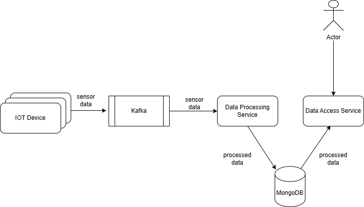

# IoTDataPipeline

## Project Overview

This project aims to build a scalable and secure pipeline to collect and process data from multiple IoT devices, such as thermostats, heart rate meters, and car fuel gauges. The data will be continuously generated by these IoT devices, and the pipeline will handle the ingestion, processing, storage, and retrieval of sensor data for analysis. The system will allow querying of specific sensor data (average, median, max, min) over a specific timeframe via a secure web service.

## Key Considerations

### 1. **Scalability**
- **Requirement**: The system should be able to handle a growing number of IoT devices that send continuous data.
- **Solution**: We will leverage scalable, distributed systems, using message queues and databases that allow horizontal scaling. For instance, using **Kafka** for data ingestion ensures that data streams can be scaled independently of the processing components.

### 2. **Reliability**
- **Requirement**: The system should be fault-tolerant and ensure that no data is lost.
- **Solution**: We ensure data reliability by using:
    - **Kafka** for message persistence.
    - **MongoDB** for reliable storage with automatic failover using replica sets.

### 3. **Availability**
- **Requirement**: The system should be highly available, ensuring minimal downtime.
- **Solution**: High availability is achieved by load balancing and replicating both the **Kafka** and **MongoDB** clusters.

### 4. **Fault Tolerance**
- **Requirement**: The system should be resilient to failures and recover gracefully.
- **Solution**:
    - **Kafka Consumer Groups**: Ensuring no data loss if a consumer fails.
    - **MongoDB Replica Sets**: Automatic failover in case of database node failure.

## Database Design

We use **MongoDB** to store sensor data. The following collections will be used:

### Collections

1. **devices**: Stores metadata about the IoT devices.
    - `_id`: Unique identifier for each device.
    - `device_type`: Type of the IoT device (e.g., Thermostat, Heart rate monitor).
    - `created_at`: Timestamp when the device was created.

2. **sensor_readings**: Stores readings from devices.
    - `_id`: Unique identifier for each reading.
    - `device_id`: Reference to the IoT device (`devices` collection).
    - `value`: Sensor reading value (e.g., temperature, heart rate, fuel).
    - `unit`: The unit of the sensor reading (e.g., °C for temperature, bpm for heart rate, liters for fuel). This field provides context for the reading's measurement unit.
    - `timestamp`: Timestamp when the reading was recorded.

3. **aggregated_data**: Stores precomputed aggregate values (average, min, max) for a specific timeframe.
    - `_id`: Unique identifier for the aggregation.
    - `sensor_id`: Reference to the specific sensor.
    - `timeframe_start`: Start of the timeframe for aggregation.
    - `timeframe_end`: End of the timeframe for aggregation.
    - `avg_value`: Average reading for the timeframe.
    - `min_value`: Minimum reading for the timeframe.
    - `max_value`: Maximum reading for the timeframe.

## High-Level Architecture

The architecture consists of the following components:

1. **IoT Device Simulator**: Simulate data from IoT devices that send data every second.

2. **Kafka Message Broker**: Collects data from devices and distributes it to processors.

3. **Data Processing Service**: Consumes data from Kafka topics, processes it, computes aggregates (average, min, max), and stores it in MongoDB.

4. **Data Access Service**: Exposes secure REST APIs for querying sensor data (average, min, max).

5. **MongoDB Database**: Stores raw sensor data and aggregated results.

### High-Level Block Diagram

## Known Limitations

### 1. **Performance**
- **Issue**: MongoDB is scalable but may require further optimizations to handle very large datasets effectively.
- **Solution**: Performance enhancements such as **indexing** and **sharding** should be implemented to ensure that the system can handle large volumes of data from many IoT devices.

### 2. **Fault Tolerance**
- **Issue**: While MongoDB provides **basic replication** and **failover**, more advanced configurations may be necessary for larger-scale production environments.
- **Solution**: For greater fault tolerance and high availability, advanced MongoDB configurations such as **sharded clusters** and **geo-replication** can be considered.

## 3. **Scalability**

- **Issue**: Embedding aggregation logic within the data processing service makes it difficult to scale for large data volumes, as the entire service must be scaled. This approach works well for simple calculations (e.g., average/median/max/min values), but becomes inefficient when handling more complex aggregations at scale.
- **Solution**: Isolating the aggregation logic into a dedicated microservice allows for independent scaling of the aggregation component, optimizing resource utilization and improving performance when dealing with large datasets.

## Conclusion

This prototype demonstrates a **scalable**, **fault-tolerant**, and **flexible** IoT data collection and processing system using **MongoDB** for storage. By leveraging **Kafka** for message ingestion, **Spring Boot** for processing and API services, and **MongoDB** for data storage, the system is designed to:
- Handle a growing number of IoT devices.
- Provide **real-time data analysis** and querying of sensor data.
- Ensure **reliability** and **fault tolerance** by using a combination of Kafka for message queuing and MongoDB for data storage.

This architecture can serve as a base for building a fully-fledged production system by addressing the noted limitations and optimizations for scalability and performance.
